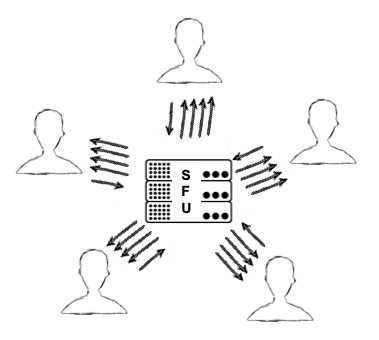

VideoApp: A Flutter WebRTC P2P Video Calling App
=================================================

A simple P2P video calling app made using *[Flutter](https://flutter.dev/)* that supports calling from browser to browser, phone to phone, browser to phone and opposite. It aims to demonstrate [WebRTC Protocol]() baiscs.

[](https://spdx.org/licenses/MIT.html)
[](./)

<p align="center">
<a href="https://www.android.com/" target="_blank" rel="noreferrer">  </a>
<a href="https://dart.dev" target="_blank" rel="noreferrer">  </a>   
<a href="https://flutter.dev" target="_blank" rel="noreferrer">  </a>
<a href="https://firebase.google.com/" target="_blank" rel="noreferrer">  </a> 
</p>


</br>


|                              |                              |                              |                       |
| :---------------------------:|:----------------------------:|:----------------------------:|:---------------------:|
|   |   |   |  |

Made using _Previewed [^1]_

[^1]: https://previewed.app/template/CFA62417


</br>

## **Demonstration :**

This is little demo between two chrome windows. It is recorded at 30 fps and the device was lagging so it's not all that smooth.

<sub> _You may wait a little before the gif loads depending on your internet connection_</sub>

<p align="center">
  
</p>

</br>

Table of contents
-----------------

* [Introduction](#introduction)
* [WebRTC](#webrtc)
  * [About](#about-the_protocol)
  * [Working Principle](#working-principle)
    * [Offer, Answer and SDP](#offer-answer-and-sdp)
    * [Signalling Server](#signalling-server)
    * [ICE](#ice)
    * [STUN Server](#stun)
    * [TURN Server](#turn)
  * [Approaches to connecting more than two peers](#approaches-to-connect-more-than-two-peers)
* [Installation](#installation)
* [Usage](#usage)
* [Known issues and limitations](#known-issues-and-limitations)
* [License](#license)
* [Authors and history](#authors-and-history)
* [Acknowledgments](#acknowledgments)


</br>

Introduction
------------

A simple P2P video calling app made using *[Flutter](https://flutter.dev/)*. 
You can call from browser to browser, phone to phone, browser to phone and opposite.

The app uses flutter_WebRTC package for the backend and Firebase's Firestore realtime database as a signaling server to establish the connection between the two peers. 

Note that it is not mandatory to use Firebase. You  can use whatever you want as long as you exchange the SDP and ICE Candidates information between the peers.

It is also not mandatory to use WebRTC at all. You can also use :
 
 - ### _RTMP (Real-Time Messaging Protocol)._ 

 - ### _HLS (HTTP Live Streaming)._

 [Read more on RTMP, WebRTC & HLS: Battle of the Live Video Streaming Protocols](https://www.100ms.live/blog/rtmp-vs-webrtc-vs-hls-live-streaming-protocols)
 

</br>

WebRTC 
-------

</br>

<p align="center">
  
</p>

</br>

* [About](#about-the_protocol)
* [Working Principle](#working-principle)
  * [Offer, Answer and SDP](#offer-answer-and-sdp)
  * [Signalling Server](#signalling-server)
  * [ICE](#ice)
  * [STUN Server](#stun)
  * [TURN Server](#turn)
* [Approaches to connecting more than two peers](#approaches-to-connect-more-than-two-peers)

</br>


### **About the Protocol**

</br>

#### ***WebRTC:***
- Is an HTLM5 standard
- Uses Javascript
- Allows you to control the camera and microphone in the browser with no downloads
- Is encrypted and secure

In other words, WebRTC allows you to set up a live peer-to-peer connection between two different browsers – or more – to exchange private video, audio, and data between them. WebRTC is a form of Real-Time Communication (RTC). 

The set of standards that comprise WebRTC makes it possible to share data and perform teleconferencing peer-to-peer, without requiring that the user install plug-ins or any other third-party software.

</br>

[Mozzilla WebRTC Documentaion](https://developer.mozilla.org/en-US/docs/Web/API/WebRTC_API) : Mozilla Developer site has an excellent WebRTC API documentation. You should refer to it as the flutter_webRTC plugin does not has enough documentaion but the api is mostly the same.

</br>


### **Working Principle:** 

As most of the backend is handled and implemented by the browsers, the process _should?_ be pretty straightforward :

1. Client 1 created an offer asking for another client to connect to them.

2. Client 2 reads the offer and creates an answer for it.

3. Connection estabilished 🎉!

Unfortunatelly, in real world, things are not so simple. 🤷‍♂️

Private WebRTC endpoints are often shielded from the public internet by a network that does the mapping from source to the destination. The mapping facilitates traffic going in or out of the private systems to reach the correct host. This process is called _**Network Address Translation, or NAT**_. For solving this, we have to learn about some additional words such as ICE,STUN and TURN.


</br>


* #### **Offer, Answer and SDP:**

  The caller collects information about himself and creates a type of message known as “offer” that is sent to the callee, only that instead of saying “I’m smart and funny”, the information will contain data such as video resolution and audio condecs to be used on the call. The callee receives this data, stores it and creates an “answer” with its own info to be received and stored by the caller. The information is exchanges using the Session Description Protocol (SDP), which is a format published by the IETF to transport these kinds of data.

* #### **Signalling Server:**

  A simple one time information exchange server. You will only need it when you want to share the offer/answer or ICE candidates you created with the other peer. After that this server goes out of the picture. I used a realtime database as the signalling server here but you are good as long you exchange this information somehow, even with _Carrier Pigeons_ :dove: .

* #### **ICE:**

  While not necessarily restrictive, NAT interfaces need to be pin-holed to create a public-private pair for media streams to flow from the outside world into the WebRTC browser. This process of gathering candidates and prioritizing them in order to make a successful media connection with the remote peer, as defined in in RFC 8445, is called _Interactive Connectivity Establishment (ICE)_.

  A large percentage of WebRTC calls have network restrictions for calls between parties who are not on the same network. This includes calls from a peer with symmetric public-private pairing (NAT) or calls from a network having additional firewall restrictions such as in universities or office spaces. These can face black video issues (missing feed/no packet reception) or fail at the ICE gathering stage leading to no connection. Such cases can benefit from two main protocols : _STUN and TURN_.

* **STUN and TURN Servers:**

  In order to do WebRTC across different networks, we need to bypass firewalls and we also have all kinds of restrictions set by ISPs, in order to bypass this restrictions and punch a hole in the receptors firewalls to get media through we need to rely on a STUN/TURN server.

  - #### **STUN:**

    Also known as _Session Traversal Utilities for NAT (STUN)_. An endpoint under a NAT with a local address is not reachable for other endpoints outside the local network. Hence a connection cannot be established. When this occurs, the endpoint can request a public IP address from a STUN server. Other endpoints can use this publicly reachable IP to establish a connection.

    You don't have to pay for a STUN server as they are many free ones available. In this project we used a server provided by google.

  - #### **TURN:**

    Also known as _Traversal Using Relays around NAT (TURN)_. As the name suggests, a TURN server is used as a relay or intermediate server to exchange data. If any endpoint under Symmetric NAT can contact a server on the public internet to establish a connection with another endpoint, it is called a TURN client.

    But, a disadvantage of using a TURN server is that it is required throughout the whole session, unlike the STUN server, which is not needed after the connection is established. Therefore, in the ICE technique, STUN is used as default.

  In simpler words, a STUN server is used to get an external network address. TURN servers are used to relay traffic if a direct (peer-to-peer) connection fails.


### **Approaches to connect more than two peers:**

</br>

_So what if you want to chat with one more than one person ? Below are three approaches you can try :_

</br>

1. ***Mesh :***
<p align="center">
  
</p>

</br>

- On the left, we show a simple peer-to-peer call. Two users are connected with each other via a signaling process (which you create as part of your app), and then an RTC Peer Connection is established. At this point, all data is exchanged between the peers directly, without using your server.

- If you try to scale the same architecture to a group call, it gets much more complicated, as shown on the right side of the figure above. The signaling process on your web server still exists, but it’s been removed from the diagram, and now we are just showing how complex a mesh network of peer-to-peer connections between each party in the group call looks. Handling so many connections causes a lot of processing burden on each peer, so your group call will frequently fail.

- To support group chats, as well as to include other features like call recording and transcription, most applications incorporate a media server to handle the traffic between the peers and scale better.

- That leads us to a brief discussion of the two types of media servers: SFUs and MCUs.

</br>

2. ***MFU (Multipoint Control Units) :***
<p align="center">
  
</p>

</br>

- Each peer in the group call establishes a connection with the MCU server to send up its video and audio. The MCU, in turn, makes a composite video and audio stream containing all of the video/audio from each of the peers, and sends that back to everyone.

- Regardless of the number of participants in the call, the MCU makes sure that each participant gets only one set of video and audio. This means the participants’ computers don’t have to do nearly as much work. The tradeoff is that the MCU is now doing that same work. So, as your calls and applications grow, you will need bigger servers in an MCU-based architecture than an SFU-based architecture. But, your 
participants can access the streams reliably and you won’t bog down their devices.
- Media servers that implement MCU architectures include Kurento (which Twilio Video is based on), Frozen Mountain, and FreeSwitch.

</br>

3. ***SFU (Selective Forwarding Units) :***

<p align="center">
  
</p>

</br>

- In this case, each participant still sends just one set of video and audio up to the SFU, like our MCU. However, the SFU doesn’t make any composite streams. Rather, it sends a different stream down for each user. In this example, 4 streams are received by each participant, since there are 5 people in the call.
- The good thing about this is it’s still less work on each participant than a mesh peer-to-peer model. This is because each participant is only establishing one connection (to the SFU) instead of to all other participants to upload their own video/audio. But, it can be more bandwidth intensive than the MCU because the participants each receive multiple streams downloaded.
- The nice thing for participants about receiving separate streams is that they can do whatever they want with them. They are not bound to layout or UI decisions of the MCU. If you have been in a conference call where the conferencing tool allowed you to choose a different layout (ie, which speaker’s video will be most prominent, or how you want to arrange the videos on the screen), then that was using an SFU.
- Media servers which implement an SFU architecture include Jitsi and Janus.

</br>

Installation
------------
First, you should  download or clone the repository.
 
 The app uses FireStore to exchange the offer/answer informations as well as the ICE candidates. So you must have a firebase project that has FireStore Database enabled.

 ***⚠️ Important: You also must have Flutter and  Firebase_CLI tools installed. And you must enable FireStore Database for your project in testing mode from Firebase console.***
 
And then you have to generate the firebase_options.dart file which will contain your access tokens and configuration for each platform that you choose to support. Using the following lines : 

``` powershell
flutter pub add firebase_core
flutter pub add cloud_firestore
flutterfire configure
```

Additionally, you can also refer to the [Official Guide](https://firebase.google.com/docs/flutter/setup?platform=android) in the firebase documentaion.

</br>

**For Android Phones :**

You need to add the following permissions to your AndroidManifest file :

``` gradle
<uses-permission android:name="android.permission.INTERNET"/>
<uses-feature android:name="android.hardware.camera" />
<uses-feature android:name="android.hardware.camera.autofocus" />
<uses-permission android:name="android.permission.CAMERA" />
<uses-permission android:name="android.permission.RECORD_AUDIO" />
<uses-permission android:name="android.permission.ACCESS_NETWORK_STATE" />
<uses-permission android:name="android.permission.CHANGE_NETWORK_STATE" />
<uses-permission android:name="android.permission.MODIFY_AUDIO_SETTINGS" />
```
The only prerequisite needed to install the app on android is having a __min SDK of 21__, as some dependencies in the project require this.

 You should add  _'minSdkVersion 21'_  to the build gradle file under `android/app/build.gradle` : 

Example :
``` gradle
    defaultConfig {
        applicationId "com.example.video_app"
        minSdkVersion 21
        targetSdkVersion flutter.targetSdkVersion
        versionCode flutterVersionCode.toInteger()
        versionName flutterVersionName
    }
```

Then you can run the app directly in your emulator or real device via :

``` powershell
flutter run
``` 

Note this will create and install  a debug apk. Refer to the [flutter documentaion](https://docs.flutter.dev/deployment/android) on how to create and sign a production app if you wish. 

You can also run the app in chrome or edge :

``` powershell
flutter run -d web # or flutter run -d chrome/flutter run -d edge 
```

Usage
-----
_Please ensure you have an active internet connection first._

The app is realy simple, once you start it you should be greeted with the home screen :
 
<p align="center">
  
</p>

You can either join a room or create one your self. 

If you decide to create one your self you will ve taken to a second screen.

_Note than you must give camera and audio permission for the  app to work._

After giving your permission you should see your self via the front camera :

<p align="center">
  
</p>

Now you just have to click on the _'Call'_ button, which will automaticlly generate a roomId for you :


Copy this id and give it to the person that you wish to call. You can just proceed to the meeting room directly via the 'Open Room' button.

On the other end, a web browser for example. Open the 'Join Room' screen and paste the roomID :

<p align="center">
  
</p>

After you click _'Join'_ button , you should be taken to the meeting room directlly :

<p align="center">
  
</p>

At this point the connection should be eestablished and you should be able to hear and see each other.

_(Note : if you are able to hear the other person but can not see him or your self please press the camera button twice. See [Known issues and limitations](#known-issues-and-limitations))_


Known issues and limitations
----------------------------

+ **Camera Issue** : 

  You may be able to hear the other person in the room but you are unable to see your self or the other person. The issue is caused by a failure to  call _setState(() {})_ function in the app when a peer has connected. It can be simply solved by pressing the camera button in the meeting room twice.

+ **Resources Leak** : 

  The MediaStream coming from the camera is not disposed of unless you close the app or press _'Hang Up'_ button in the meeting room. Which means the camera will still be working in the background if you just click Join Room or Create Room without actually connecting or if you leave the meeting room bu clicking the back button in the navigation bar.

+ **Not disconnecting when the peer ends the call** : 

  If the peer ends the call or disconnets for whatever reason, the host is not notified or redirected to the home screen. They will just notice that the other person audio has stopped and the video has stopped at the last transferred frame.

+ **Unhandled Errors and Exceptions** : 

  They are causes that can lead to errors or exceptions but are left unhandled :
    * Not having an active internet connection.
    * Not giving required permissions.
    * Entering a wrong roomID.
   


License
-------

This program is distributed under the terms of the [MIT License (MIT)](https://spdx.org/licenses/MIT.html).  The license applies to this file and other files in the [GitHub repository](https://github.com/esammahdi/Processing/edit/main/Terrain%20Generator/) hosting this file.


Authors and history
---------------------------

* Esam Bashir : The original author.


Acknowledgments
---------------

Really big thanks to : 

- 100ms blog post [A Comprehensive Guide to Flutter-WebRTC](https://www.100ms.live/blog/flutter-webrtc#about-the-flutter-webrtc-server) .
- Fireship's [WebRTC in 100 seconds](https://www.youtube.com/watch?v=WmR9IMUD_CY) youtube video.
- [WebRTC Ventures](https://webrtc.ventures/) for WebRTC explanations.
- [lamb1engcode](https://github.com/lamb1engcode/sandbox_webrtc-flutter?ref=flutterawesome.com) for assets used in explaining WebRTC.
